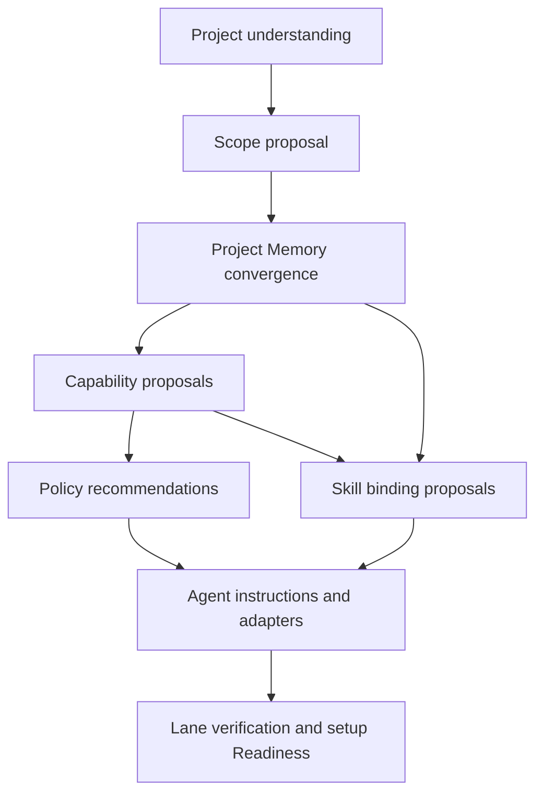

# Intelligent Project Onboarding

Skopos onboarding turns an arbitrary repository into a coherent environment for
ongoing coding-agent work. The coding agent investigates and exercises judgment;
Skopos keeps the investigation bounded, decisions explicit, accepted outcomes durable,
and Readiness truthful.

## Changelog

- `2026-08-14`: Made setup conversation state explicit and fail-closed. While material
  questions remain, the current question and answer command are the only continuation,
  consolidated review is unavailable, and agent-authored Scope or document analysis
  must be submitted into resumable setup state before review. Recorded the post-public
  clean-core and compatible-edge boundary.
- `2026-08-13`: Implemented one setup runtime behind setup, status, review, decide,
  answer, and resume. The implementation emits a bounded agent packet, creates
  evidence-bound Memory work items, checkpoints partial application, detects Node,
  Python, Go, Rust, Java, and .NET checks, and accepts delivery only after the real host
  confirms the exact bound Session context rather than inferring it from adapter presence.
- `2026-08-13`: Made accepted setup readiness repository-native across clean
  checkouts. Init and Session context reconstruct durable setup from the completed
  unified-setup certification Task, its source-bound snapshot, and current tracked owners; only
  affected lanes become stale when those owners drift.
- `2026-08-13`: Connected unified setup to normal Session context, made lifecycle
  answers alter actual project mode, made edit requests require a source-bound revised
  recommendation, and made missing host proof return a command that can resolve it.
- `2026-08-13`: Added the selective setup-response transport and evaluation contract.
  Setup receives the detailed communication layer only while it is useful, resumes
  from bounded stage state, and does not impose onboarding tokens on ordinary project
  work.

## User Journey

The canonical user-facing lifecycle is:

```text
Understand -> Clarify -> Review -> Apply -> Verify
```

The default command is `skopos setup .`. `setup status`, `setup resume`, and
`setup review` project the same workflow. Natural-language agent requests use that
authority rather than implementing an informal parallel setup.

### Understand

Skopos compiles deterministic discovery and gives the coding agent an executable
onboarding packet. The agent inspects permitted project evidence and explains its
current understanding before recommending changes.

### Clarify

The agent asks only questions whose answers alter product truth, architecture, Scope
ownership, authority, security, public behavior, retention, or another material setup
boundary. Safe organizational details remain recommendations rather than mandatory
questions.

### Review

The user receives one consolidated plan grouped by outcome: project understanding,
project areas, Project Memory, checks, project rules, specialist guidance, and coding
agents. Recommendations support accept, edit, defer, and reject. The review explains
what changes, why it helps, risk, retained truth, and anything still unverified.

### Apply

The agent performs only operations in the revised approved envelope. Each subsystem
writes through its existing authority. Failure stops dependent stages and leaves an
exact resumable state. Agent-owned Scope and document work preserves the approved
operation, source and target paths, retained truth, information-loss risk, and source
digest in the executable packet. It becomes applied only after `setup
submit-completion` recaptures the stated postconditions from current project sources;
an acceptance choice or an unbound "done" statement is not completion Evidence.

### Verify

Skopos rebuilds relevant indexes and verifies each readiness lane from current tracked
sources and source-bound receipts. It reports `setup-ready` only when all required
lanes pass.

## Dependency Order



Scopes precede restructuring because target Memory paths require accepted ownership.
Capabilities precede Skills because a Skill may require project Actions and Guards.
Agent instructions are compiled after accepted Memory, Policy, and Skill outcomes are
known.

## Executable Agent Packet

Skopos generates a bounded packet that contains:

1. objective and current setup stage
2. project root, authorized sources, and prohibited paths or effects
3. deterministic inventory and confidence-bearing discovery signals
4. required reads ordered by likely authority and relevance
5. prior user answers and accepted, deferred, or rejected recommendations
6. analysis steps and plain-language response objective
7. machine output schema and exact local submission path
8. allowed automatic work and operations requiring approval
9. prohibited claims and mutations
10. exact continuation or recovery command

The packet instructs the agent to inspect real source rather than restating scanner
output. It requires facts, inferences, user-confirmed intent, contradictions, and
unknowns to remain distinct. The agent never has to reverse-engineer an internal JSON
schema or guess which command advances setup.

## Project Understanding

Discovery may include, when present and authorized:

1. source roots and dependency structure
2. applications, services, packages, domains, tools, and infrastructure
3. configuration and environment contracts
4. tests, fixtures, and test configuration
5. builds, task runners, CI, deployment, and release workflows
6. APIs, routes, schemas, and migrations
7. README files, documentation, Decisions, Plans, TODOs, and notes
8. agent instructions and host configuration
9. useful Git history

Language and repository discovery is provider-based. Node package metadata is one
provider, not the product boundary. Python, Go, Rust, Java, .NET, mixed-stack, and
custom command providers contribute the same normalized evidence without becoming
canonical authority.

## Scope Proposal

The agent proposes meaningful ownership units rather than mirroring every directory or
manifest. Each candidate includes:

1. human-friendly purpose
2. kind and stable id
3. code roots and proposed Memory root
4. parent and dependencies
5. suggested owners
6. confidence and evidence
7. consequence for retrieval, work ownership, and validation

Unambiguous minimal topology may be recommended as one group. Ambiguous boundaries
become user questions. Accepted topology is written to the Scope registry before
Memory operations target those roots.

## Project Memory Convergence

The agent first builds an authority map across current documentation and relevant code
evidence. It may propose:

1. `keep`
2. `move`
3. `merge`
4. `split`
5. `rewrite`
6. `archive`
7. `delete`
8. `create-from-evidence`

Every operation names retained truth, authority impact, link impact, and information
loss. Destructive or ambiguous operations require explicit approval.

`create-from-evidence` supports projects with missing documentation. Its draft binds
facts to source paths, labels inferences and unknowns, records user-confirmed intent,
and proposes Scope, role, authority, and owner. A created document becomes canonical
only after review and successful strict verification. The workflow creates the minimum
useful Memory for the project; empty role families are forbidden.

When documentation and implementation disagree, code is evidence of current behavior,
not automatic authority over intended behavior. The conflict remains visible until a
user decision or existing accepted source resolves it.

## Capabilities, Policies, And Skills

Capability discovery spans root and nested commands, task runners, language providers,
CI, tests, migrations, browsers, security, generators, and project-specific tools.
Every proposed capability explains command, working directory, Scope, inputs, effects,
safety, use conditions, and Evidence contract. Approval produces tracked Actions and
Guards; discovery alone produces no executable authority.

Policies are recommended from project evidence and risk. They remain proportional:
small projects do not inherit large-system ceremony, while high-impact domains do not
receive weak defaults.

Skills are recommended only after lifecycle, Scope, Memory, capability, Guard, and host
evidence is available. Skopos generates a project binding proposal and explains where
the Skill applies, what it adds, and which missing roles prevent adoption. Accepted
Skills remain task-selective and never enter every prompt by default.

## Conversation Model

The setup response has four semantic blocks:

1. what Skopos understands
2. what it recommends and why
3. the one material decision currently needed, if any
4. what happens next

Every question provides evidence, recommendation, alternatives, trade-offs, result of
the answer, and safe deferral behavior. The agent normally asks one material question
at a time and batches only related, reversible, low-risk choices.

`questions-open` is an ask-and-wait boundary, not an early review state. The setup
result and Session context inline the exact current question, recommended default,
alternatives, and answer command. They explicitly forbid inferred answers, queued
question batching, a consolidated plan, and blanket approval. `setup review` does not
render recommendations until every blocking material question is resolved.

Agent-authored claims, Scope proposals, and document operations do not become setup
state merely because they appeared in conversation. The generated packet names the
analysis path, schema, and exact `setup submit` command. Review begins only from the
submitted, source-bound analysis and deterministic project evidence.

Progress reports use outcomes such as “comparing architecture claims” or “verifying
agent context delivery.” They do not stream artifact paths or internal state changes.
Completion explains what improved for future coding-agent work and lists deferred or
unverified items.

The four blocks are semantic and conditional: an empty decision block is omitted, and
the agent does not repeat prior understanding when only a small delta changed. The
detailed setup conversation guide is loaded for initial understanding, material
questions, plan review, resumed setup, and completion. Ordinary apply progress receives
only the current stage, meaningful delta, blocker, and next step.

The setup packet is allowed to exceed the ordinary response-context target because it
contains bounded project Evidence and approval state. It remains progressive: required
reads and evidence slices are retrieved by stage, accepted results are referenced by
identity, and unchanged findings are summarized instead of replayed. Setup must not
make the always-on communication contract larger for every future coding turn.

Release and onboarding-change evaluations cover at least undocumented, chaotic,
contradictory, minimal, and mixed-stack projects. They verify that the agent leads with
a plain-language project understanding, translates internal terms, recommends a
default, asks one material question, remembers the answer, distinguishes optional
deferral from a blocker, and explains improvement at completion. These evaluations run
as implementation and release proof rather than an extra model call on each user turn.

## Decision And Invalidation Model

Recommendations have stable identities derived from their owning subsystem and
material source state. The user may accept, edit, defer, or reject each recommendation.

1. edit produces a revised proposal before approval
2. defer preserves an open recommendation without blocking optional readiness
3. reject suppresses repetition while its material source identity remains current
4. source change invalidates only affected dispositions and downstream approvals
5. natural-language partial approval is parsed into explicit section dispositions and
   shown back when interpretation is material

No broad approval silently absorbs newly discovered paths, commands, Policies, Skills,
or destructive operations.

## Resumability And Failure

Each stage records current local state and source identities. Applying a stage first
validates its approval, dependencies, effects, and collision boundary. A failure:

1. stops dependent work
2. preserves completed valid subsystem outcomes
3. reports whether any source changed
4. names invalidated recommendations or approvals
5. provides one exact resume or repair step

The workflow does not promise one filesystem transaction across independent project
tools. It provides staged idempotence, exact approval, effect-aware execution, and
truthful partial-state reporting.

## Readiness Lanes

Required lane state is explicit:

| Lane | Ready when |
| --- | --- |
| Understanding | material claims are classified and blocking questions are resolved |
| Scopes | accepted registry resolves ownership, roots, ancestry, and dependencies |
| Project Memory | approved operations and evidence-bound creation pass strict catalog checks |
| Capabilities | required project checks have reviewed providers and declarations |
| Policies | required accepted rules resolve without blocking drift |
| Skills | required bindings validate; optional deferrals remain visible |
| Agent instructions | canonical source and mirrors agree |
| Host delivery | the host proves context delivery, or the lane reports an explicit manual fallback |

Configured files do not prove host delivery. `setup-ready` requires every required lane
to pass from current state. Optional deferrals produce
`setup-ready-with-deferred-options`.

### Clean-checkout reconstruction

Ignored `.skopos/**` artifacts are checkout-local projections, never the durable proof
that a project completed setup. On a fresh checkout, Skopos reconstructs accepted
setup state from the latest typed, canonically completed high-impact unified-setup certification Task,
its immutable source-bound snapshot, and current tracked owners for Memory, Scopes,
Actions, Guards, canonical instructions, mirrors, and configuration.

The certification Task uses the normal Task authority, required Actions and Evidence,
immutable snapshot, verification, and finish lifecycle; setup cannot manufacture a
completed Task as a shortcut. Reconstruction does not copy ignored state, replay proposal approval, or create a
tracked omnibus setup manifest. It recompiles checkout-local indexes and host adapters,
then reports `agent-ready` when current tracked owners still satisfy the certification.
If an owner changed, Skopos marks only its dependent lane stale and gives a bounded
repair direction. Missing certification, unreadable proof, contradictory owners, or
failed current checks remain fail-closed.

## Clean Implementation Boundary

The existing lower-level onboarding surfaces are prototype implementation material.
Implementation replaces their public ceremony with the canonical setup workflow and
removes superseded commands, states, schemas, tests, docs, and projections in the same
slices. Diagnostic primitives remain only when they have a distinct advanced or
recovery purpose and operate under the same authority.

No versioned migration, alias, dual reader, compatibility shim, or legacy setup mode is
part of the first release. After publication, clean refactoring remains the internal
policy, while the package, executable, supported CLI/config contract, and adopter-owned
tracked project truth form the compatible public edge defined by
[D-20260814](../decisions/D-20260814-clean-core-compatible-public-edge.md).
