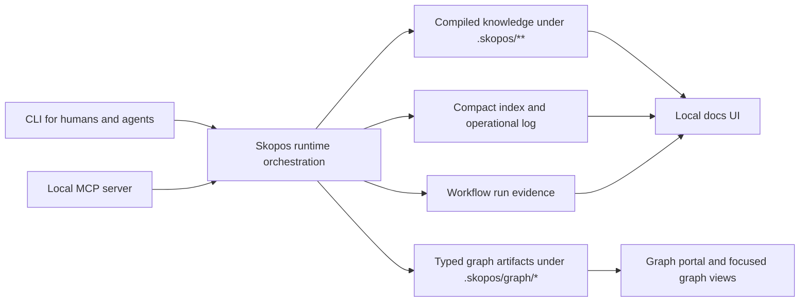

# Runtime Model

Skopos runs locally inside a repo and should be the project-intelligence layer beneath existing coding tools.

## Metadata

- Doc ID: `SKOPOS-ARCH-RUNTIME-MODEL`
- Status: `active`
- Owner: `skopos-core`
- Scope: `skopos/architecture`
- Canonical: `yes`
- Last Updated: `2026-04-11`
- Review Cycle: `per workpack`
- Related Docs:
  - `00-architecture.md`
  - `config-model.md`
  - `trust-and-closure-model.md`

## Changelog

- `2026-04-11`: Added a compact runtime-lanes diagram so the relationship between CLI and MCP entrypoints, compiled artifacts, the docs UI, and the graph portal is visible without pushing raw graph structure into the main product narrative.
- `2026-04-10`: Updated the runtime model to reflect actor-attributed `scan` lifecycle events with knowledge-index refresh, so brownfield diagnosis now participates in the normal operational loop instead of sitting outside it.
- `2026-04-10`: Updated the runtime model to reflect optional actor attribution for `init`, `trust`, and `impact`, so the normal bootstrap and validation loop no longer writes anonymous lifecycle events by default.
- `2026-04-10`: Updated the runtime model to reflect `instructions-sync` as a first-class runtime lifecycle event with knowledge-index refresh and optional actor attribution.
- `2026-04-09`: Updated the runtime model to reflect explicit source-dependency invalidation on compiled bootstrap state and proof coverage for refresh after package and docs source changes.
- `2026-04-09`: Updated the runtime model to reflect that compiled-state-first hot-path reads are now implemented for query, trust, impact, and plan, not only planned.
- `2026-04-09`: Updated the runtime model to make hot-path commands explicitly compiled-state-first, with cold compile pressure concentrated in `init` and `scan` rather than daily `resolve`, `context`, `trust`, `impact`, and `plan` loops.
- `2026-04-09`: Updated the runtime model to reflect the implemented `.skopos/index.json` and `.skopos/log.jsonl` lifecycle surfaces that now track init, plan, workflow, trust, impact, done, and override events.
- `2026-04-09`: Updated the runtime model to reflect the compiled enforcement profile and generated Claude Code hook adapter as the first tool-native enforcement surface.
- `2026-04-09`: Updated the runtime model to reflect subtree-targeted `init` and `scan` flows for large workspaces.
- `2026-04-09`: Updated the runtime model to reflect the compiled `.skopos/architecture.json` artifact and the current-state versus recommended-state architecture split for brownfield repos.
- `2026-04-09`: Refined the runtime model around the ingest-compile-query-lint-trust-compound loop, plus planned index and log surfaces for cheap navigation.
- `2026-04-09`: Updated the runtime model to reflect the first graph-backbone slice: runtime-managed workspace, mission, and impact graph artifacts under `.skopos/graph/`.
- `2026-04-09`: Updated the runtime model to reflect the first implemented project-workflow slice: discovery, inspection, execution, and `.skopos/runs` evidence.
- `2026-04-09`: Updated the runtime model to reflect that local runtime flows now include repo diagnosis and remediation reporting in addition to bootstrap, retrieval, planning, and trust.
- `2026-04-09`: Added the first runtime model so CLI, MCP, generated artifacts, and docs UI can evolve under one local-first contract.

## Runtime Shape

1. local CLI for humans and agents
2. local MCP server for compatible coding tools
3. repo-native generated artifact set under `.skopos/`
4. local docs UI for human-readable knowledge and trust views
5. repo diagnosis and remediation reports that help agents avoid normalizing poor patterns
6. compiled architecture interpretation under `.skopos/architecture.json` with current and recommended views
7. project-registered workflow execution for repo-specific docs, reference, and validation tasks
8. generated workflow run evidence under `.skopos/runs/`
9. compiled enforcement profile under `.skopos/enforcement.json`
10. generated tool-native hook adapters under `.skopos/tooling/**`
11. typed internal graph artifacts under `.skopos/graph/`
12. compiled content index and operational log surfaces for cheap navigation and recency tracking
13. subtree-targeted bootstrap and scan mode for large workspaces before fuller incremental rebuild support exists
14. scan-driven refresh of the durable diagnosis artifact under `.skopos/diagnosis.json`

## Runtime Lanes Diagram

This diagram keeps the main runtime surfaces visible without flattening everything into one whole-repo graph.

## Operating Loop

1. ingest:
   - read raw project signals from code, docs, tests, configs, workflows, and diffs
2. compile:
   - produce durable project knowledge under `.skopos/` and generated views under `docs/generated/`
3. index and log:
   - maintain compact navigation state and an operational record of what changed and when
   - include scan and instruction-sync events alongside init, plan, workflow, trust, impact, done, and override activity
   - keep bootstrap and validation events actor-attributed when a human or agent identity is available
4. query:
   - load compiled knowledge first, not raw broad-repo state
5. lint:
   - health-check the knowledgebase for stale artifacts, contradictions, orphaned knowledge, and missing canonicals
6. trust:
   - gate completion through `impact`, `done`, and `trust`
7. compound:
   - file useful outputs back into the project knowledgebase so repo understanding accumulates over time

## Runtime Rules

1. Skopos does not own model inference
2. Skopos does not replace the coding tool front-end
3. core value must remain available without cloud dependency
4. writes should be previewable and explainable
5. project-specific workflows should be registered, typed, and safety-classified before agents use them
6. graph artifacts should stay internal-first and feed humans only through curated, focused views
7. raw sources remain source material; compiled project knowledge is the default operating memory
8. index and log surfaces should stay compact and token-cheap
9. search and richer retrieval tools are helpers, not the core runtime model
10. large-repo slices must stay explicit through subtree metadata so partial compilation does not masquerade as full-workspace truth
11. tool-native enforcement should extend the CLI and MCP core rather than becoming a separate product surface
12. hot-path commands should prefer compiled `.skopos` state and recompile only when explicit invalidation says they are stale
13. invalidation should be driven by compact source-dependency probes in compiled state rather than by falling back to routine full rescans
14. shared tool-facing maintenance commands like `instructions sync` should participate in the same runtime log and index loop as other write paths
15. bootstrap, diagnosis, and validation commands like `init`, `scan`, `trust`, and `impact` should not lose actor provenance just because they are common lifecycle steps
