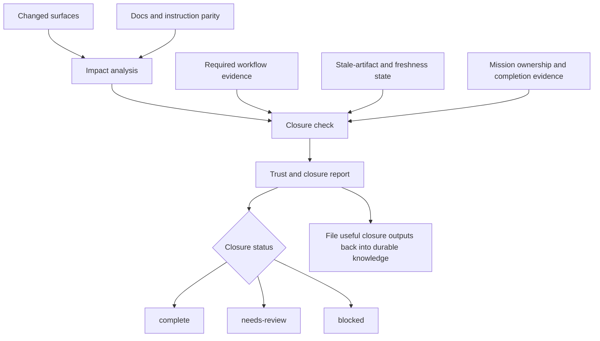

# Trust And Closure Model

Skopos should make “done” evidence-backed rather than summary-backed.

## Metadata

- Doc ID: `SKOPOS-ARCH-TRUST-CLOSURE-MODEL`
- Status: `active`
- Owner: `skopos-core`
- Scope: `skopos/architecture`
- Canonical: `yes`
- Last Updated: `2026-06-29`
- Review Cycle: `per workpack`
- Related Docs:
  - `runtime-model.md`
  - `retrieval-and-query-strategy.md`
  - `decision-escalation-model.md`

## Changelog

- `2026-06-29`: Clarified that first-time Skopos onboarding files are allowed to pass active-mission coverage when they are only the expected generated setup surfaces.
- `2026-04-12`: Reconciled stale advisory decision drift during eval, so older missions no longer keep `decision-*` items pending in `.skopos/evals/*.json` after the linked workflow question has disappeared or already resolved for that mission.
- `2026-04-12`: Tightened trust and done around workflow-router state, so unresolved blocking questions now fail closure directly, mission eval artifacts are explicit closure evidence, and `skopos eval` ignores self-referential mission-eval pressure while producing its own proof.
- `2026-04-12`: Tightened the eval-to-closure handoff so successful mission evaluation now reconciles remaining non-decision checklist drift and leaves `skopos next` recommending explicit mission completion instead of returning to stale implementation steps.
- `2026-04-12`: Updated the trust and closure model after `skopos eval` landed, so mission-level evaluation artifacts now exist and the remaining closure gap is enforcement of unresolved questions and required eval outputs rather than the absence of the eval lane itself.
- `2026-04-11`: Expanded the next closure contract to include workflow-router question and eval surfaces, so unresolved `must-ask` decisions and missing eval outputs are now part of the intended closure model instead of remaining external process discipline.
- `2026-04-11`: Hardened git-status-based closure inference so `skopos done` now ignores generated workflow outputs such as `.skopos/**`, `docs/generated/**`, and instruction mirrors, and only infers `instructions.sync-mirrors` from instruction surfaces or explicit workflow inputs instead of generic docs churn.
- `2026-04-11`: Added a compact closure-flow diagram so humans can see how changed surfaces, workflow evidence, docs parity, and stale-artifact checks combine into trust and closure without reading the whole section linearly.
- `2026-04-10`: Updated the trust and closure model to reflect actor-attributed workflow run evidence, so closure can report who produced the latest successful required workflow run.
- `2026-04-10`: Updated the trust and closure model to reflect actor-aware mission ownership checks inside `skopos done --mission`, so closure can verify ownership as well as completion state.
- `2026-04-09`: Updated the trust model to reflect docs-health scanning for missing `docs/00-start-here.md` routing and stale tracked docs metadata inside the canonical docs root.
- `2026-04-09`: Refined the trust model to include knowledgebase lint health, stale-artifact handling, and compounding outputs as first-class trust concerns.
- `2026-04-09`: Updated the closure model to reflect that required workflows are now inferred during impact analysis and checked during closure against fresh successful run evidence.
- `2026-04-09`: Updated the closure model to reflect the first implemented workflow-evidence slice: runtime-generated `.skopos/runs/*.json` artifacts now exist, while workflow requirements in `plan`, `impact`, and `done` are still the next integration step.
- `2026-04-09`: Updated the closure model to reflect mission-based closure evidence through `skopos mission complete` and `skopos done --mission <id>`, plus the distinction between workflow artifacts and immutable derived artifacts.
- `2026-04-09`: Updated the closure model to reflect that `skopos impact` and `skopos done` fall back to the current git diff when changed paths are not supplied explicitly.
- `2026-04-09`: Updated the trust model to reflect working `skopos impact` and `skopos done` slices, including instruction parity and generated-artifact closure gates.
- `2026-04-09`: Updated the trust model to reflect the first working `skopos trust` slice, including readiness states and bootstrap/mirror checks.
- `2026-04-09`: Added the trust and closure baseline so Skopos can distinguish completed work from trustworthy work.

## Trust Report Inputs

1. changed surfaces
2. checks passed and failed
3. docs and instruction sync state
4. unresolved assumptions
5. answered and pending human decisions
6. provenance for important conclusions
7. workflow run evidence for required custom project workflows
8. stale-artifact and freshness state for required compiled knowledge
9. lint and health-check results for the project knowledgebase
10. unresolved workflow-router questions
11. eval status for required mission or change-class proof

## Closure Flow Diagram

The important shape here is how multiple proof inputs converge into one explicit closure decision.

## Current Implemented Slice

The current `skopos trust` slice reports:

1. whether `skopos.config.yaml` exists
2. whether `.skopos/bootstrap.json` and `.skopos/scopes-lite.json` exist
3. whether the canonical docs root exists
4. whether the canonical docs router `docs/00-start-here.md` exists
5. whether tracked docs metadata indicates stale docs in the canonical docs root
6. whether `AGENTS.md` exists
7. whether instruction mirrors have been generated
8. whether bootstrap scan findings still need review
9. whether tracked source/workflow changes are covered by an active or recently completed claimed mission
10. whether tracked changes are only first-time Skopos onboarding files

Fresh Skopos onboarding is a special case for active-mission coverage. When `skopos.config.yaml` is part of the change set and every tracked changed path is an expected onboarding surface, trust should pass with a review-and-commit message instead of asking the user to start a mission just to install Skopos. Later product, source, docs, or hand-edited instruction changes still require normal mission coverage.

It currently classifies readiness as:

1. `bootstrap-needed`
2. `needs-review`
3. `agent-ready`

The current closure slices also report:

1. changed path classification and affected scopes
2. instruction mirror parity, not only mirror presence
3. derived artifact hand-edit detection for immutable `.skopos/**` state
4. optional mission-based closure evidence when `done` is given a mission id
5. docs-review requirements when code-like surfaces change without docs updates
6. closure status as `complete`, `needs-review`, or `blocked`
7. current git diff as the default changed-surface source when paths are not supplied
8. required workflow inference for matching changed surfaces
9. workflow freshness checks based on successful `.skopos/runs/*.json` evidence
10. latest workflow-evidence actor attribution for required mutating workflow runs
11. mission ownership checks so `done` can warn or fail when a mission is claimed by a different actor
12. git-status fallback filtering that treats workflow outputs as closure noise rather than primary source edits
13. blocking workflow-question closure evidence from `.skopos/questions.json`
14. mission-eval closure evidence from `.skopos/evals/*.json`, including missing or incomplete eval output
15. advisory decision reconciliation during eval when a mission no longer has an active unresolved linked workflow question

The current mission slice also supports:

1. inspecting persisted missions
2. claiming and releasing missions through the CLI
3. marking a mission complete through the CLI
4. using mission completion as explicit closure evidence
5. using mission ownership as additional closure evidence when `done` is given `--mission` and `--actor`

The next workflow-extension increment should support:

1. MCP exposure for workflow registry and execution
2. stronger approval policy enforcement for `requiresApproval`
3. richer stale-output and dependency validation beyond current file-change freshness checks

The next trust increment should also support:

1. explicit knowledgebase lint passes for contradictions, orphaned knowledge, and unresolved canonical conflicts
2. clearer stale-artifact reporting tied to source dependencies
3. append-oriented trust logging so recent verification history is visible to both humans and agents
4. recommendation visibility from `.skopos/recommendations.json`
5. adapter and UI-facing closure explanations that distinguish router blockers from ordinary trust warnings without forcing users into raw artifact inspection

## Closure Rules

1. trust must fail closed when required proof is missing
2. docs and instruction drift count as closure problems, not cleanup later
3. completion confidence should be explicit rather than implied
4. workflow artifacts may evolve through Skopos commands, but immutable derived artifacts must still be regenerated rather than edited directly
5. required project workflows must become explicit closure inputs rather than hidden tribal knowledge
6. stale compiled knowledge is a closure problem when the affected artifact is required for the change
7. useful closure outputs should file back into durable project knowledge instead of disappearing into chat history
8. required mutating workflow evidence should carry actor attribution so humans and agents can see who produced the latest successful proof
9. unresolved `must-ask` workflow questions must block closure instead of remaining advisory
10. required eval outputs must be explicit closure inputs when the change class is structural, risky, or otherwise marked high-impact
