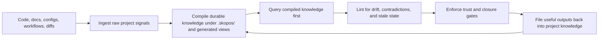

# Skopos Overview

Skopos is a local-first SDK that turns a repo into an agent-safe working environment.

## Metadata

- Doc ID: `SKOPOS-PROJECT-OVERVIEW`
- Status: `active`
- Owner: `skopos-core`
- Scope: `skopos/project`
- Canonical: `yes`
- Last Updated: `2026-07-25`
- Review Cycle: `per workpack`
- Related Docs:
  - `vision.md`
  - `positioning.md`
  - `agentic-operating-plan.md`
  - `roadmap.md`
  - `human-guidance-and-developer-experience-plan.md`
  - `../architecture/00-architecture.md`
  - `../architecture/agent-native-operating-model.md`

## Changelog

- `2026-07-25`: Converged the overview on one agent-native control plane and the compact
  context/action/guard model. The coding agent reasons and implements; Skopos protects
  intent, project truth, capabilities, deterministic proof, and memory promotion.

- `2026-06-29`: Added the agentic operating direction: explicit project modes, command-guided agent prompts, and cleanup/refactor behavior are now part of the core Skopos promise.

- `2026-06-24`: Added the human guidance direction so Skopos is explicitly responsible for explaining project state, agent progress, decisions, blockers, and next steps in simple language while keeping strict machine artifacts on disk.
- `2026-04-12`: Added the token-control and compact-agent-transport doctrine to the overview, so retrieval, runtime output, and continuity now share one explicit rule: keep full truth on disk but keep the default agent path compact and progressive.
- `2026-04-12`: Added the supervision-cost and workflow-weight discipline to the overview, so future control-plane work is now explicitly judged by whether it removes more user supervision than the extra process weight it adds.
- `2026-04-12`: Extended the overview with the program-router direction, so Skopos is now explicitly expected to sequence accepted work and derive docs plus UI obligations through compiled state above the mission router instead of leaving that order in user memory.
- `2026-04-12`: Updated the overview with the discussion-memory direction, so the next continuity layer is now explicit: Skopos should preserve accepted direction across compaction through checkpoints and handoffs instead of replaying raw chat history.
- `2026-04-11`: Clarified the operating promise so Skopos is now explicitly expected to route the next step after discussion instead of leaving execution sequencing in agent or user memory.
- `2026-04-11`: Added a compact operating-loop diagram so the ingest-compile-query-lint-trust-compound model is easier to scan in the routed docs reader without replacing the canonical graph lane.
- `2026-04-09`: Refined the overview around a compiled project knowledgebase model, a brownfield-first wedge, and the explicit ingest-compile-query-lint-trust loop.
- `2026-04-09`: Added the core overview so contributors can understand the product in one page before reading deeper architecture docs.

## What Skopos Is

Skopos is:

1. a project brain for coding agents
2. a planning compiler for project work
3. a compiled project knowledgebase that accumulates and maintains repo understanding over time
4. a docs and instruction governance runtime
5. a trust and drift-control layer for agent-produced changes
6. a command-guided agent operating layer that tells coding agents how to work in the selected project mode
7. the single adoptable project workflow and closure authority for coding agents

Skopos is not:

1. an LLM provider
2. a hosted coding agent
3. a replacement for Codex or Claude Code
4. a generic wiki
5. a personal-notes product with no workflow or trust model
6. a second coding agent that reproduces general planning and reasoning
7. a peer workflow stacked beside another project-specific LLM control plane

## Smallest Public Model

1. context: what the agent needs to know
2. actions: what the project allows the agent to do
3. guards: what must be prevented, approved, or proven

Workflows, packs, integrations, skills, and host adapters compile into those three
concepts. The canonical detail is
`docs/architecture/agent-native-operating-model.md`.

## Core Promise

Keep using your preferred coding agent. Skopos gives it compiled project knowledge, workflow discipline, and trust gates so it can work more reliably inside real codebases.

The next continuity increment should make that promise survive context boundaries by compiling discussion checkpoints and compact handoffs instead of relying on remembered chat history.

The next control-plane increment should make that promise survive reprioritization too by compiling accepted work, sequencing, and obligations above the mission router instead of leaving queue order to user memory.

The next transport increment should keep canonical truth rich on disk while making the default agent path compact and progressive, so Skopos stops spending context on full artifact payloads, replayed validation state, and historical docs that are not needed for the current step.

The next human-guidance increment should make Skopos clear to the developer supervising the work. CLI output, UI surfaces, workpack summaries, and agent answers should explain status, risk, blockers, questions, proof, and next steps in simple English while raw machine artifacts remain available on demand.

The next agentic-operating increment should make project mode explicit. Existing projects may need preservation, clean refactor, or greenfield reset behavior. Skopos must guide agents differently for each mode so cleanup-heavy work removes obsolete paths instead of adding duplicate hybrid systems.

Those increments only belong if they reduce supervision cost more than they add workflow weight. Skopos should not solve supervision problems by turning itself into a heavier process system than the one it is replacing.

## Product Discipline

Every new Skopos feature should answer one question before it lands:

`Does this reduce user supervision cost without increasing workflow weight more than it saves?`

That rule is the restraint layer on top of the roadmap:

1. extend existing compiled surfaces before adding new ones
2. keep default retrieval and resume context compact
3. prefer attention-shaped UI over dashboard sprawl
4. reject layers that mainly add ceremony, duplication, or another manual ritual
5. reject retrieval or transport paths that replay raw state when a compact projection would do
6. reject user-facing output that reports machine status without explaining what it means and what to do next

## Core Operating Model

1. ingest raw project signals from code, docs, configs, workflows, and diffs
2. compile them into durable project knowledge under `.skopos/` and generated views
3. query the compiled knowledge first instead of re-deriving repo understanding from scratch
4. lint the knowledgebase for drift, contradictions, stale state, and missing canonicals
5. enforce trust and closure through evidence-backed gates
6. file useful outputs back into the knowledgebase so project understanding compounds over time
7. preserve recent accepted direction across chat compaction through compact discussion memory instead of raw transcript replay
8. keep default command transport and retrieval compact enough that normal self-hosted workflow does not burn context windows on operational replay
9. present the compiled truth in human language before asking users to inspect raw artifacts
10. generate command-level agent briefs that explain reads, lane, risks, do/do-not guidance, checks, and closure expectations
11. preserve current task intent through compact goal, scope, acceptance, non-goal,
    constraint, decision, and proof fields
12. keep admission, changed iteration, stabilization, and final closure separate so
    expensive proof has one execution owner
13. let downstream projects contribute domain-specific context, actions, and guards
    without maintaining parallel task state or closure

## Operating Loop Diagram

The main loop is small on purpose. Skopos should keep relationship shape readable without turning the overview into a graph explorer.

## Primary Outcomes

1. better brownfield repo understanding before implementation begins
2. better context selection during implementation with lower token waste
3. clearer human decision points
4. better docs, workflow, and instruction sync
5. better trust at completion time
6. project knowledge that compounds instead of disappearing into chat history
7. lower supervision cost when a long-running discussion crosses compaction or a new chat boundary
8. lower coordination overhead when accepted work changes priority or interrupts the current queue
9. lower workflow ceremony by keeping new control-plane surfaces proportionate to the supervision burden they remove
10. lower token waste through compact briefs, progressive retrieval, and smallest-sufficient validation lanes
11. better developer experience through plain-language status, guided questions, visible progress, and clear next steps
12. better cleanup/refactor execution through explicit project modes and no-legacy guidance when the user wants a clean target architecture
