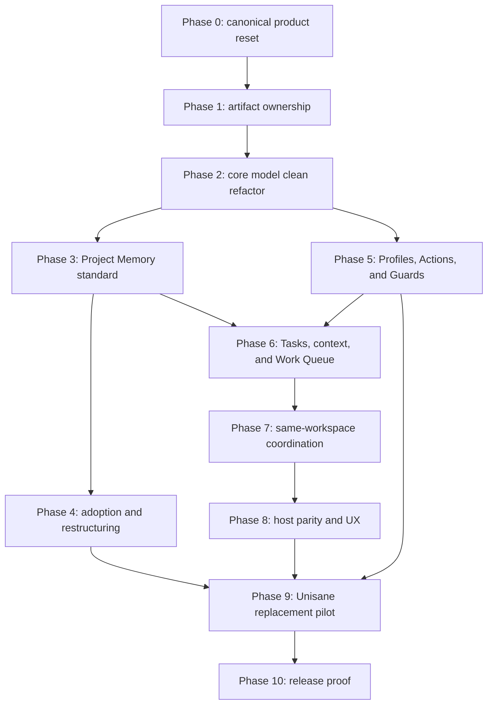

# Canonical Product Convergence Plan

## Changelog

- `2026-08-03`: Implemented the first Action hermeticity slice. Manifests now require
  capabilities, effects, concurrency, and truthful artifact-producing safety;
  preflight returns deterministic unavailable runs, Git worktree mutations are checked
  against declared effects, per-run artifact roots prevent collisions, and Evidence
  identity binds the contract. Offline packed-install certification, general exclusive
  scheduling, and external-effect enforcement remain open.
- `2026-08-03`: Implemented the canonical Task work disposition state machine.
  Ownership release is state-neutral; explicit resume, ready, defer,
  return-from-verification, cancel, and successor-linked supersede transitions now
  produce deterministic Work Queue behavior. Host-specific mutation parity remains.
- `2026-08-03`: Implemented the stale coordination recovery slice: a live replacement
  writer can atomically resume or release a stale reservation after fail-closed
  contamination/open-mutation checks, with recovery generation, ledger summary, and
  concurrent one-winner proof. Explicit Task work dispositions remain next.
- `2026-08-03`: Implemented the direct-path slice of the Task-local proof boundary:
  five-way admission/mutation attribution, other-Task and external exclusion,
  causal detailed diagnostics, compact counts, and the 64-path mixed-worktree target.
  Generated/dependency attribution, immutable snapshot proof, and explicit Project
  integration Readiness remain in the workstream.
- `2026-08-03`: Added a cross-cutting operational reliability workstream from the
  downstream pilot: isolate Task proof from Project integration, complete stale
  Session and Task disposition recovery, make exact Evidence reuse interaction-cheap,
  bound detailed agent transport, and require hermetic, truthfully classified
  certification Actions. The work remains in the owning Phases 5 through 10 rather
  than creating a parallel Plan.
- `2026-07-31`: Implemented admission-time durable Memory obligations with explicit
  closure resolution and serialized complete Task read-modify-persist transactions
  through the local coordination broker; remote coordination and broader Phase 7
  mutation-ledger work remain open.
- `2026-07-31`: Made `finish` the one public closure transaction, compact JSON the
  agent hot-path default, and Action fingerprints explicitly narrow through precise
  inputs plus reviewed source exclusions.
- `2026-07-30`: Converged validation on one tracked Guard and Action path: removed
  command/action mode switching, raw Plan/Impact check lists, task-goal Action
  guessing, and policy-label package-script guessing. Added stable policy Guard ids,
  explicit missing-provider diagnostics, Task-derived Guard/Action requirements,
  Task Action Evidence Links, and native Memory integrity in Verify. Remaining Phase 5
  work includes full Action effect/concurrency contracts and cross-language fixtures.
- `2026-07-28`: Completed and archived Task T-62a045f9 after its final generic-product
  audit and source-bound closure proof. The remaining generic Profile, promotion,
  restructuring, and adoption-Readiness work stays open under this Plan.
- `2026-07-28`: Closed Task T-62a045f9's final audit gaps across generated-reference
  placement, adopted/discovery isolation, public-context inheritance, generic Scope
  consumers, unique Memory roots, and colocated-memory freshness. Final source-bound
  closure proof remains with the Task.
- `2026-07-28`: Kept Task T-62a045f9 open after its final contract audit found four
  generic-product edge gaps that must close before self-adoption can be accepted.
- `2026-07-28`: Strengthened the self-adoption slice with one strict YAML grammar,
  canonical role paths, deepest-root Scope ownership, duplicate-id quarantine, fresh
  query Memory, and Scope-aware compact retrieval for every active or durable Memory
  role, including failure-pattern negative knowledge.
- `2026-07-28`: Completed the implementation portion of the Project Memory
  self-adoption slice: migrated Skopos to the canonical workspace and Scope grammar,
  declared stable Scopes, normalized document metadata, compiled Patterns and
  failure-pattern negative knowledge, removed hand-maintained registries, and repaired
  links and host instructions. Archived Task T-62a045f9 records final reconstruction
  and closure proof. The remaining generic Phase 3 enforcement and Phase 4 adoption
  workflow are not implied complete.
- `2026-07-28`: Implemented the Phase 1 tracked/local ownership boundary, hard-migrated
  all executable local paths into the declared family, removed prototype authority
  maps and local acceptance sources, and proved clean reconstruction. Canonical Task
  and derived Work Queue reconstruction remains the explicit dependency before Phase 1
  closure.
- `2026-07-28`: Final Phase 0 validation removed the deleted
  `docs/project/execution/**` lifecycle exception and added explicit Phase 3 proof for
  declared document metadata and authority-aware compact context selection.

- `2026-07-28`: Completed Phase 0: promoted P1-W11's still-valid behavioral
  contracts, recorded clean capability dispositions, archived superseded product and
  execution authority, repaired active and historical document links, and made this
  Plan plus the canonical decision the only target route.

- `2026-07-28`: Created the clean pre-release implementation Plan for converging
  Skopos on the accepted Project Memory, Task, Action, Guard, Evidence, Readiness, and
  same-working-directory coordination contract.

## Objective

Refactor the current Skopos prototype into the one product that should be released:

> A repo-native operating memory and trust layer that helps Codex, Claude Code, and
> other coding agents understand, continue, change, verify, and maintain any adopted
> software project without drift or repeated context reconstruction.

This Plan replaces the P1-W11 compatibility convergence. It uses no product-version
framing and creates no backward-compatibility layer.

## Outcome

At completion:

1. Skopos has one public vocabulary.
2. every fully adopted project has a predictable Memory structure.
3. arbitrary legacy docs layouts are discovery input, not permanent runtime shape.
4. nested monorepos and project-specific needs work through Scopes and Profiles.
5. Plan and Task have non-overlapping authority.
6. Work Queue is derived rather than manually synchronized.
7. all project capabilities are Actions selected by Guards.
8. acceptance criteria map to fresh Evidence.
9. Readiness explains whether work can start, integrate, or close.
10. `.skopos/**` is disposable and rebuildable.
11. several coding-agent Sessions can work safely in one branch and working directory.
12. Codex and Claude Code receive the same lifecycle and project truth.
13. Unisane uses Skopos instead of its prior LLM workflow.
14. no Unisane-specific rule or path exists in Skopos core.
15. the first public package contains no legacy prototype API.
16. one Task can close proportionally in a shared dirty worktree without claiming
    Project integration or release readiness.

## Definition Of Done

The Plan is complete only when:

1. all phase exit criteria pass
2. all superseded decisions and execution docs are archived
3. active docs describe one product model
4. current architecture docs match implemented code
5. the clean-clone and multi-Session proof suites pass
6. the full adopter proof matrix passes
7. the Unisane replacement pilot passes
8. CLI, MCP, UI, generated instructions, packages, schemas, tests, and docs contain no
   active legacy authority
9. release smoke passes from a packed installation
10. remaining limitations are explicit product limitations, not compatibility debt
11. stale Session recovery and every supported Task disposition pass crash and
    concurrency proof
12. reusable exact Evidence enters a Task without repetitive per-Action execution
    calls
13. compact and detailed agent transports meet measured response budgets
14. release-certification Actions pass hermetic and declared-effect proof

## Non-Goals

1. build another coding agent or model provider
2. reproduce native agent reasoning, plan generation, tool choice, or subagent control
3. standardize application source-code architecture across adopters
4. hardcode Unisane's domains, paths, packages, or validation commands
5. require every small edit to create a tracked Task
6. claim preventive cross-machine coordination without a remote authority
7. ship a broad extension SDK before Profiles, Actions, and Guards prove sufficient
8. preserve current local `.skopos/**` state
9. create migration guidance for an unreleased prototype
10. retain old terms as aliases or hidden schema fields

## Clean-Refactor Constraints

1. no `v2` label
2. no deprecated exports
3. no old command aliases
4. no dual reads or writes
5. no fallback schema parser
6. no legacy artifact lookup
7. no old UI route redirects
8. no temporary compatibility projection
9. no package-boundary shim
10. no “remove later” path without a same-Task deletion step

Refactor technique:

1. introduce the canonical owner only when the same Task can remove the replaced owner
2. delete or rename the old export first
3. repair compiler failures across every consumer
4. update tests, docs, help, fixtures, generated projections, and package exports
5. run focused proof
6. integrate only after the old surface is unreachable

Git history and archived decisions preserve prototype history. Runtime code does not.

## Current Implementation Boundary

This Plan and its accepted decision describe target truth. The current repository still
implements Mission, Workpack, Program, Workflow, Gate, Eval, Trust, compatibility
projections, and worktree-oriented state.

Until a phase lands:

1. current operational commands may be used only to work on the prototype safely
2. they must not be documented as the target product
3. target architecture docs stay labeled `view: target`
4. implemented architecture docs stay labeled current and link to this Plan
5. no completion claim may treat the decision alone as implementation proof

## Known Contradictions To Remove

| Current condition | Canonical resolution |
| --- | --- |
| accepted decisions allow permanent brownfield mapping | mapping is discovery-only; full adoption restructures |
| `.gitignore` ignores `.skopos`, while artifact docs commit parts of it | all `.skopos/**` is local and rebuildable |
| Plan, Mission, Workpack, and Program overlap | Plan + Task + derived Work Queue |
| command and Workflow/Action validation coexist | one Action catalog selected by Guards |
| `requiredForDone` lives on executable manifests | Guards require Evidence |
| active state is global or worktree-oriented | Session- and Task-scoped local state |
| worktrees are the concurrency recommendation | same-directory broker is normal; worktrees are optional |
| verification reads a mixed live tree | closure verifies an immutable Task snapshot |
| generated UI lives under docs | runtime UI lives under `.skopos/ui` |
| manual registries and sequential ids create conflicts | metadata-derived indexes and collision-resistant ids |
| Node/TypeScript support is presented as the product boundary | implementation may be Node; adopter model is language-independent |
| active docs mix current, target, transition, and historical truth | explicit view/lifecycle/authority metadata |

## Prototype Capability Disposition

The completed Phase 0 disposition record is
[`T-51c74ec2`](../archive/T-51c74ec2-prototype-capability-disposition.md).
It prevents the clean refactor from confusing deletion of prototype APIs with deletion
of proven product behavior.

The governing rule is:

1. retain useful behavior only under a canonical target owner
2. rewrite regression seeds to target vocabulary and artifacts
3. delete the prototype owner, name, schema, command, and compatibility path
4. rerun proof; historical P1 results are not proof of the clean model

## Dependency Order

Do not implement later compatibility or UI polish ahead of the owning model phase.

## Cross-Cutting Operational Reliability Workstream

The downstream replacement pilot exposed gaps across several owning phases. They do
not create another active Plan or a new executable lifecycle object. Implement them as
bounded Tasks under this Plan in the following dependency order:

1. **Generic regression fixtures and measurements**
   - translate pilot symptoms into project-agnostic fixtures
   - capture current selected Actions, response bytes, tool calls, Task states,
     effects, and recovery outcomes before changing semantics
2. **Task-local proof boundary**
   - implement Decision
     `D-20260803-task-local-proof-and-project-integration-readiness-boundary`
   - preserve admission-baseline classifications and causal impact reasons
   - separate narrow Task closure from explicit Project integration Readiness
3. **Session recovery and Task disposition**
   - complete audited stale takeover and release without requiring the stale Session
   - define exact resume, ready, defer, supersede, cancel, and verification transitions
4. **Action effects and hermeticity**
   - complete effect, capability, output, environment, and concurrency declarations
   - certify offline release Actions and isolated artifact-producing Actions
5. **Evidence reuse and bounded transport**
   - attach valid exact Action Runs to Task requirements in one bounded operation
   - paginate or reference large detailed collections while keeping blockers inline
6. **Cross-project proof and promotion**
   - pass new application, healthy and messy brownfield, non-Node, nested monorepo,
     shared dirty worktree, and packed-install scenarios
   - close each Finding only after its acceptance matrix passes and durable architecture
     truth reflects implemented behavior

Each implementation Task owns one independently closable slice and links its Finding.
Do not keep an umbrella Task active after children or successors own all remaining
work. A Project integration Task proves the combined candidate only after affected
Tasks close.

## Phase 0 — Canonical Product Reset

### Purpose

Make one decision and one Plan the only target authority before broad implementation.

### Work

1. accept the canonical product decision
2. create this Plan at the target `docs/work/plans/` location
3. mark conflicting decisions superseded
4. archive superseded decisions after updating every active link
5. archive P1-W11 after promoting still-valid proof facts
6. replace the active glossary with the canonical vocabulary
7. simplify `docs/00-start-here.md` to a compact router
8. update vision, overview, positioning, roadmap, proof plan, and implementation
   checklist
9. label current implementation docs and target docs honestly
10. add an active finding for any unresolved product-contract contradiction
11. stop creating sequential Decision, Finding, Plan, or Task ids
12. stop adding `Review Cycle: per workpack`

### Exit Criteria

1. one active decision owns the target
2. one active Plan owns implementation
3. no default read path routes through a superseded decision
4. no active product doc presents Mission, Workpack, Program, Workflow, Gate, Eval,
   Trust, compatibility migration, permanent mapping, or worktree-first coordination as
   target behavior
5. old decisions and P1-W11 are historical and excluded from default retrieval
6. docs links and metadata checks pass

### Completion Record

Phase 0 completed on `2026-07-28`.

1. Decision `D-8d32a27b` is the sole target product authority.
2. this Plan is the sole active implementation authority.
3. superseded decisions, P1 workpacks, completed findings, and obsolete project plans
   are physically archived.
4. reusable prototype behavior is promoted in the canonical decision and the completed
   capability-disposition Task.
5. active routers no longer send agents through superseded product authority.
6. archive documents remain navigable but are excluded from default retrieval.

## Phase 1 — Reproducible Artifact Ownership

### Purpose

Make durable truth and local generated state impossible to confuse.

### Work

1. define tracked owners for:
   - config
   - instructions
   - Scopes and Profiles
   - Actions and Guards
   - Policies and Skills
   - docs, Decisions, Findings, Plans, and tracked Tasks
2. move accepted overrides and policy choices out of `.skopos/**`
3. make `.skopos/**` entirely ignored
4. define the clean local runtime family:
   - `project.json`
   - `index/`
   - `graph/`
   - `sessions/`
   - `tasks/`
   - `evidence/`
   - `handoffs/`
   - `runs/`
   - `ui/`
   - `coordination.sqlite`
   - `cache/`
5. route all runtime UI output to `.skopos/ui/**`
6. route checked-in human reference output to `docs/reference/generated/**`
7. add rebuild orchestration from tracked sources
8. add source-digest invalidation
9. add a clean-delete/rebuild test
10. ensure generated indexes are deterministic

### Deletions

1. committed `.skopos` authority rules
2. `.skopos/overrides.json` as durable shared truth
3. `.skopos/index/policies/resolved.json` as the only accepted policy source
4. durable Plan or Task authority under `.skopos`
5. runtime HTML/app output under docs
6. legacy artifact lifecycle maps and compatibility paths

### Exit Criteria

1. `git ls-files .skopos` returns nothing
2. deleting `.skopos` loses no durable truth
3. a clean clone reconstructs Project, Scope, Memory, Action, Guard, Policy, and Work
   Queue state
4. local Evidence is either regenerated or explicitly imported from a trusted CI/remote
   attestation
5. no reader references a removed artifact family
6. generated output ownership checks pass

## Phase 2 — Canonical Core Model Refactor

### Purpose

Replace prototype schemas and names before dependent product behavior grows further.

### Work

1. define canonical ids and schemas for:
   - Project
   - Scope
   - Profile
   - Memory record
   - Plan
   - Task
   - Session
   - Work Queue item
   - Action
   - Guard
   - Evidence
   - Readiness
2. delete old model contracts
3. replace public and internal exports in one dependency-ordered pass
4. update config schemas
5. update runtime services
6. update CLI and MCP contracts
7. update UI state and routes
8. update fixtures and serializers
9. update package exports
10. rename the `trust` package if it remains public; the public concept is Readiness
11. use collision-resistant ids for concurrent document and Task creation
12. remove product-version fields or migrations that exist only for the prototype

### Required Renames

| Remove | Add |
| --- | --- |
| `SkoposMission*` | `SkoposTask*` |
| mission service/path/graph | Task service/path/graph |
| mission item | Task step |
| mission slice | child Task |
| workpack lane | high-impact risk |
| normal lane | standard risk |
| `SkoposProgram*` | `SkoposWorkQueue*` |
| program state/brief | Work Queue projection |
| `SkoposWorkflow*` | `SkoposAction*` |
| workflows command/path | actions command/path |
| gate contracts/command | Guard contracts/inspection |
| eval contracts/command | verify contracts/command |
| trust user surface | Readiness surface |
| public receipt | Evidence |

### Exit Criteria

1. removed symbols have zero source usages
2. CLI help contains only the canonical commands
3. MCP exposes only canonical tools
4. UI routes and labels contain only canonical nouns
5. JSON schemas contain no legacy fields
6. no alias, fallback reader, redirect, or dual writer exists
7. model, config, runtime, CLI, MCP, and UI focused tests pass

## Phase 3 — Project Memory Standard

### Purpose

Make project knowledge predictable for agents without forcing application code into one
architecture.

### Work

1. implement the workspace Memory grammar
2. implement Scope memory roots with one relative grammar
3. implement required document metadata:
   - id
   - Scope
   - role
   - lifecycle
   - authority
   - provenance
   - view
   - owner
4. implement role-specific metadata when relevant:
   - Pattern kind
   - applicability
   - relationships
   - freshness
   - evidence
5. implement Scope registry fields:
   - stable path-independent id
   - kind
   - parent
   - Profile
   - memory root
   - code roots
   - dependencies
   - owners
6. implement core Profiles
7. compile every active or durable Memory role into local indexes and relevant compact
   Task context
8. remove hand-maintained registries
9. enforce lifecycle routing:
   - active and durable in default retrieval
   - historical in archive
   - dead deleted
10. enforce current/target/transition/exception views
11. update link and freshness validation
12. ensure no empty directories are scaffolded
13. enforce promotion rules so inferred/proposed Memory cannot self-promote
14. compile relevant rejected, superseded, failed, and retired patterns as compact
    negative knowledge without loading historical docs by default
15. parse declared lifecycle, authority, provenance, and view as first-class catalog
    inputs rather than reconstructing authority only from path, status, or a legacy
    canonical flag
16. make compact role selection rank the highest applicable accepted authority and
    include the active Plan without relying on filename order

### Self-Adoption Slice

Archived Task T-62a045f9 applied this grammar to Skopos itself before generic Phase 3
completion. It records proof of the physical tree, stable Scope declarations,
first-class metadata,
metadata-derived indexes, strict YAML and role placement, centralized and colocated
Scope ownership, all-role compact retrieval, bounded failure-Pattern selection, query
freshness, and absence of shared registries against the product repository. It does not
complete the remaining generic Profile, promotion, freshness, restructuring, or
adoption-readiness implementation.

### Monorepo Rules

1. workspace root has one Memory pack
2. every material product/application/service/package/domain may declare a Scope
3. a Scope may have several code roots
4. every Scope has at most one canonical memory root
5. parent controls governance inheritance
6. dependencies control context and impact
7. child Memory adds owned detail rather than copying parent truth
8. project-specific roles are namespaced

### Exit Criteria

1. a small library needs only the minimal Profile and docs
2. a nested monorepo resolves workspace and Scope memory deterministically
3. a multi-root Scope retrieves all owned code without path-derived identity
4. two agents can add Decisions or Findings without editing a shared registry
5. historical docs never enter the default context
6. current architecture cannot point only to target behavior
7. docs checks pass from metadata-derived indexes
8. promotion requires accepted authority and records supporting Evidence
9. relevant negative knowledge prevents a known retired pattern without replaying
   unrelated history
10. the compiled catalog preserves declared lifecycle, authority, provenance, and view
11. compact Task context can select relevant architecture, Standards, domains, guides,
    operations, Decisions, Findings, Plans, Tasks, Patterns, and references while
    respecting Scope ancestry and keeping sibling Memory isolated
12. malformed metadata, legacy aliases, role/path mismatches, unknown Scopes, duplicate
    ids, and broken links fail closed

## Phase 4 — Agent-Guided Adoption And Restructuring

### Purpose

Turn an arbitrary existing project into a predictable Skopos project instead of
permanently mapping its problems.

### Work

1. implement read-only discovery
2. compile an intake inventory of docs, code roots, instructions, scripts, CI,
   generated sources, authority conflicts, and missing roles
3. generate an agent analysis brief
4. make the coding agent inspect real source and docs
5. record facts, inferences, assumptions, contradictions, and material questions
6. generate a restructuring proposal with:
   - `keep`
   - `move`
   - `merge`
   - `split`
   - `rewrite`
   - `archive`
   - `delete`
7. show target tree and link/authority impact
8. require approval for the restructuring envelope
9. execute approved operations through Git-aware Actions
10. update links, AGENTS, config, Scope roots, and metadata
11. verify the standard
12. distinguish assessment-only from fully adopted Readiness
13. scaffold only minimum useful Memory for new projects
14. remove checked-in permanent document-projection manifests
15. compile one semantic document record for agent retrieval and UI
16. support multiple discovery sources during intake
17. enforce intake precedence:
    - accepted project/restructuring rules
    - explicit document metadata
    - source-relative Scope evidence and path heuristics
    - inferred defaults
18. invalidate the intake catalog when any discovery input changes

### Safety Rules

1. do not infer which contradictory doc is true without evidence or user acceptance
2. do not silently discard historical rationale
3. do delete dead duplication after durable truth is promoted
4. do not claim full adoption when restructuring is declined
5. do not rewrite source-code architecture merely to organize docs
6. show every material move or deletion before approval

### Exit Criteria

1. healthy brownfield adoption produces a small, low-churn proposal
2. messy brownfield adoption converges to the standard
3. conflicting truth becomes a question or accepted decision
4. no permanent arbitrary-path projection is required after full adoption
5. new-project adoption creates no empty doc families
6. agents and UI retrieve the same semantic records
7. source-relative Scope inference never becomes canonical without review and standard
   verification
8. a changed source root, rule, metadata record, or document invalidates intake output

## Phase 5 — Profiles, Actions, And Guards

### Purpose

Give every project one capability and enforcement model.

### Work

1. implement Profile inheritance
2. implement Action manifests under `tools/skopos/actions/**`
3. implement Guard sources under `tools/skopos/guards/**`
4. detect root and package scripts as integration candidates, then create explicit
   reviewed Actions; never make detected scripts executable authority automatically
   — completed with non-authoritative proposals, digest-bound approval, tracked
   Action/Guard application, collision refusal, and provider validation
5. bind accepted project Policies and Skills
6. implement the selection pipeline from impact to Evidence
7. define Action effects:
   - read paths
   - write paths
   - isolated run artifacts
   - network and external-service effects
   - process, browser, secret, and tool capabilities
   - outputs and cleanup
8. define Action safety and approval
9. define Action concurrency and lock keys
10. define Evidence schemas and freshness
11. make Guards own required Evidence
12. implement parent-strengthening and explicit exceptions
13. implement missing-provider blockers
14. replace Unisane-style gates with project bindings in the adopter, not core
15. implement exact Action execution identity and one-owner duplicate suppression
16. implement fail-fast execution with partial Evidence and resumable remaining work
17. reuse Evidence only while declared Action, source, config, environment, input,
    output, and tool bindings match
18. lease mutating Actions against pre-state and finalize Evidence against stable
    post-state
19. ignore high-churn generated state for invalidation unless it is a declared input
20. implement the bounded extension authority contract only if tracked declarations
    cannot express the proven use case
21. make release and certification Actions hermetic by default; preflight every
    declared external capability and include relevant environment identity in Evidence
22. reject undeclared workspace mutation and isolate artifact-producing Action outputs

### Deletions

1. `tools/skopos/workflows/**` — completed; declarations now live under
   `tools/skopos/actions/**`
2. workflow manifest schemas and readers — completed for the Action declaration,
   selection, execution, run-artifact, and Evidence core; Task routing fields remain
   in later deletion items
3. `skopos workflows` — completed; no compatibility command remains
4. gate-pack execution authority — completed; accepted Policies now reference stable
   Guard ids and project manifests own enforcement
5. command/action validation mode — completed; Actions are the only executable model
6. `requiredForDone`
7. shell guessing fallback — completed for Plan, Impact, and policy Guard resolution
8. workflow-specific question/recommendation/evidence types — Evidence core completed;
   question and recommendation authority remains
9. prototype `describe` / `brief` / `verify` provider schemas, version fields, exports,
   and tests unless replaced by clean target extension contracts in the same phase

### Exit Criteria

1. every executable project capability is an Action
2. every required proof decision comes from a Guard
3. root commands are a capability catalog, not a default checklist
4. missing providers fail explicitly
5. child Scopes cannot weaken required parent Guards silently
6. Actions declare concurrency truth
7. custom Action fixtures pass in different project languages
8. exact concurrent Action invocations execute once
9. stale Evidence invalidates and unchanged Evidence reuses without rerunning
10. one failed or timed-out check stops the lane and preserves an exact resume point
11. mutating Action Evidence binds the declared post-state
12. extensions cannot capture Task, decision, Readiness, or closure authority
13. certification Actions pass from a clean offline packed installation, while an
    unavailable declared external capability fails before expensive execution
14. read-only and artifact-producing Actions have distinct enforced effects

## Phase 6 — Tasks, Context, And Work Queue

### Purpose

Make one Task the execution authority while keeping durable direction and agent context
compact.

### Work

1. implement Task admission and lifecycle
2. implement Plan references without one-to-one duplication
3. implement parent/child Tasks
4. implement tracked versus local Task policy
5. compile Work Queue from tracked sources and local active state
6. make `next` Session-aware
7. implement blocking decisions
8. implement memory obligations — completed for admission inference, compact/tracked
   visibility, explicit resolution, and closure blocking
9. implement acceptance-to-Evidence coverage
10. implement progressive context:
    - L0 root instructions
    - L1 Session and Task
    - L2 Scope chain
    - L3 canonical Memory
    - L4 source, symbols, and dependencies
    - L5 history only when required
11. return deltas after first context load
12. ensure Skopos never invents product priority
13. implement admission, iteration, stabilization, and closure as separate verification
    moments
14. make risk select the one final closure proof floor
15. recompute Guard, Action, and Evidence requirements from current Task impact
16. remove satisfied bootstrap, instruction, Action, and Evidence obligations from
    `next` and `done`
17. select compact relevant negative knowledge without loading archive documents
18. compute current impact from the Task admission baseline and attributed delta before
    selecting affected Scopes and dependents
19. define explicit Task dispositions and legal transitions for resume, ready, defer,
    supersede, cancel, verification, and closure
20. link all valid reusable Action Runs to attributable Task Evidence requirements in
    one bounded operation
21. keep compact agent output within enforced budgets and expose deterministic fields,
    cursors, and artifact references for detailed collections

### Tracking Policy

1. light, single-Session Task: local allowed
2. standard, same-Session Task: local allowed when no collaboration or durable
   obligation exists
3. standard, multi-Session or collaborative Task: tracked
4. high-impact Task: tracked
5. multi-Task direction: Plan

The three lanes change Task detail, not Task identity or lifecycle. A detailed Task is
the retained workpack capability: it may carry phases, dependencies, risks, checklist,
decisions, Evidence requirements, and handoff material under one Task authority.
`Mission` and `Workpack` do not survive as parallel executable objects.

### Exit Criteria

1. no Plan/Mission pair is created for one executable unit
2. one Task owns intent, state, claims, and closure
3. Work Queue recomputes deterministically
4. two Sessions can have different current Tasks
5. context stays inside declared budgets
6. a fresh Session resumes a tracked Task without chat replay
7. acceptance gaps remain visible until fresh Evidence exists
8. admission recommendations that no longer match current impact stop blocking
9. iteration and stabilization Evidence cannot masquerade as closure Evidence
10. risk changes the final proof floor without repeating final gates at every moment
11. unrelated pre-existing or other-Task dirt cannot expand a Task's proof subject
12. reusable exact Action Runs satisfy a Task without repetitive per-Action tool calls
13. every supported Task disposition has one deterministic Work Queue meaning
14. default output retains blockers and next action while large detail remains
    progressively retrievable

## Phase 7 — Same-Workspace Session Coordination

### Purpose

Support the user's normal case: several coding-agent tabs on the same branch and in the
same working directory.

### Work

1. implement `.skopos/coordination.sqlite` with WAL and atomic transactions — Task
   authority mutations now hold one transaction across read, transition, and durable
   projection writes; other mutation classes remain in phase scope
2. implement Session registration and heartbeat
3. implement durable Task reservations
4. implement short writer leases
5. implement exact-file, pattern, semantic, Action-output, verification-input, and Git
   claims
6. forbid same-file multi-writer editing
7. implement atomic dynamic claim expansion
8. implement before/after digest mutation ledger
9. classify dirty paths:
   - current Task
   - other Task
   - pre-existing
   - external/unattributed
   - generated
10. detect contamination through a watcher and checkpoints
11. globally serialize Git mutations
12. implement Task-specific temporary index staging
13. create immutable Task snapshots
14. use compare-and-swap branch integration
15. update other Task baselines after branch movement
16. invalidate affected Evidence
17. implement Action concurrency classes
18. serialize one execution owner for each exact Action input state
19. verify from temporary snapshot checkout/container
20. implement overlay-safe live verification only for declared Actions
21. implement stale Session recovery and audited takeover
22. report enforcement level honestly
23. make stale recovery perform safe resume, transfer, or release without requiring the
    stale Session to execute a command
24. keep dirty classification and Task proof selection stable unless an attributed
    mutation, explicit adoption, dependency edge, or contamination changes them

### Mandatory Failure Cases

1. overlapping file claim
2. overlapping semantic claim
3. same file edited by two Sessions
4. unclaimed external edit
5. digest changes during a lease
6. repo-wide formatter without workspace-exclusive claim
7. Action output collision
8. `git add -A` during concurrent Tasks
9. unrelated pre-staged changes
10. branch movement during snapshot creation
11. verification input changes while a check runs
12. expired Session with dirty owned files
13. unsafe force takeover
14. blind `.git/index.lock` deletion
15. stale Session that still owns a Task reservation
16. two concurrent stale-recovery attempts
17. unrelated dirty change that expands a narrow Task's selected Actions

### Host Enforcement

1. `observed`: post-change conflict detection
2. `cooperative`: claim/checkpoint commands
3. `hooked`: pre-tool blocking
4. `mediated`: broker-owned mutations

Only `hooked` and `mediated` claim preventive safety.

### Exit Criteria

1. at least three Sessions work independent Tasks in one checkout
2. each Session receives its own current Task
3. independent-file edits proceed
4. same-file and semantic collisions block
5. external edits contaminate rather than silently transfer
6. Git operations serialize
7. snapshot verification excludes unrelated dirty work
8. crash takeover is audited
9. worktrees remain optional
10. concurrent exact Actions do not duplicate effects or Evidence
11. stale recovery has one audited winner and deterministic Task disposition
12. Task snapshot proof remains unchanged when unrelated worktree paths mutate

## Phase 8 — Host Lifecycle, Parity, And Human UX

### Purpose

Make Skopos automatic and consistent across supported coding agents.

### Work

1. implement host-neutral lifecycle events:
   - Session start
   - Task start/resume
   - before/after edit
   - before/after command
   - checkpoint
   - pre-compaction
   - before stop
   - Session end
2. generate Codex projections
3. generate Claude Code projections
4. retain one project model for both
5. implement compact handoffs
6. implement `adopt`
7. implement `memory`
8. implement `start`
9. implement `status`
10. implement `next`
11. implement `decide`
12. implement `actions list/run`
13. implement `verify`
14. implement `finish`
15. implement `doctor`
16. update CLI, MCP, and UI vocabulary together
17. make UI lead with current Task, Scope, ownership, other Sessions, blockers, next
   Action, Evidence, and Readiness
18. keep raw artifacts secondary
19. expose enforcement limitations
20. deliver one compact `session context` contract across hosts, including adaptive
    response mode and complete pending-decision guidance
21. distinguish generated adapters from installed, injected, and verified host delivery
22. expose subject, counts, blockers, and next action inline while retrieving large
    path, Evidence, queue, and impact collections through fields and cursors
23. report Evidence reuse as linked, stale, rejected, or executed without requiring an
    agent to infer the outcome from repeated Action calls

### Exit Criteria

1. Codex and Claude receive equivalent Project, Scope, Task, Action, Guard, and
   Readiness truth
2. continuation works across hosts
3. pre-compaction handoff is sufficient without transcript replay
4. users do not need to remind agents to follow Skopos
5. CLI, MCP, and UI agree on status and next action
6. advisory-only hosts never claim preventive coordination
7. compact responses meet declared byte and token budgets at representative p50 and
   p95 fixture sizes
8. every host can retrieve complete detail progressively without one unbounded payload

## Phase 9 — Unisane Replacement Pilot

### Purpose

Prove Skopos can replace the workflow that inspired it without becoming Unisane-specific.

### Work

1. inventory Unisane's root and nested docs
2. declare stable Scopes for Framework, deployables, platforms, modules, packages, and
   other real ownership units
3. select Profiles
4. generate and approve the documentation restructuring proposal
5. converge root and Scope Memory packs
6. convert Unisane commands and gates into project Actions and Guards
7. convert active Plans, workpacks, and missions into Plans and Tasks
8. remove the prior Unisane LLM workflow authority
9. regenerate agent instructions
10. run Codex and Claude sessions
11. run several same-directory Tasks
12. prove source-bound validation and closure
13. verify no Unisane path or rule entered Skopos core

### Exit Criteria

1. Unisane has one Skopos control plane
2. every material nested Scope resolves correct memory
3. Unisane-specific checks remain Unisane Action/Guard sources
4. previous LLM workflow code and docs are deleted or archived
5. same-directory parallel sessions do not conflict
6. a fresh agent continues a tracked Unisane Task without user restatement
7. Readiness and acceptance-linked Evidence pass

## Phase 10 — Release Proof

### Purpose

Prove the product contract before the first public launch.

### Work

1. run the complete fixture and live-pilot matrix
2. run clean package build
3. pack the public CLI
4. install into fresh projects
5. verify `npx`, `npm exec`, and `pnpm dlx` use
6. verify clean clone reconstruction
7. delete and rebuild `.skopos`
8. run Skopos-on-Skopos
9. scan source, package exports, schemas, CLI help, MCP tools, UI routes, docs, and
   generated projections for legacy surfaces
10. verify license, package files, versions, and release metadata
11. measure north-star continuation performance
12. prove admission, iteration, stabilization, and closure separation at every risk
    level
13. prove affected-Scope/dependent selection, dirty-boundary adoption, fail-fast
    resume, exact Evidence reuse, and current-impact reconciliation
14. prove source checkout uses source/HMR UI behavior
15. prove an installed CLI serves bundled UI assets without resolving a monorepo-local
    `@skopos/ui` package and refreshes live state through the same state endpoint
16. publish only after all must-win lanes pass
17. replay the operational reliability regression matrix for narrow Tasks in large
    dirty worktrees, stale recovery, exact Evidence reuse, bounded transport, and
    offline certification Actions

### Exit Criteria

1. all must-win proof lanes pass
2. no active compatibility or legacy finding remains
3. no old command or schema is reachable
4. no active doc describes old concepts as current or target
5. clean installs and clean-clone reconstruction pass
6. supported host parity passes
7. first release documentation reflects only the clean product
8. installed-package UI behavior passes from a fresh external project
9. no P1 proof artifact is counted as proof until its target regression passes
10. Task closure and Project integration Readiness remain distinct and independently
    explainable throughout the release proof
11. no release Action has undeclared network, filesystem, artifact, or external-service
    effects

## Cross-Cutting Deletion Inventory

Delete or rename every owner, consumer, test, and projection in these families:

1. model:
   - Mission
   - Program
   - Workflow
   - Gate
   - Eval
   - public receipt
   - compatibility task identity
2. runtime:
   - mission application services
   - program router
   - workflow router and runners
   - gate resolver
   - eval service
   - global current-mission state
   - compatibility projections
3. config/indexer:
   - workflow directories
   - document projection manifests
   - command/action validation mode
   - gate/workflow packs
   - committed `.skopos` overrides
4. trust/readiness:
   - legacy receipt fallback
   - worktree-only identity
   - mission closure evidence
   - workflow evidence
5. CLI/MCP:
   - `mission`
   - `program`
   - `workflows`
   - `gates`
   - `eval`
   - `trust` as the public readiness noun
   - old help and parser branches
6. UI:
   - Mission routes
   - Program panels
   - Workflow views
   - Gate language
   - Trust route naming
   - old generated app location
7. repository sources:
   - `tools/skopos/workflows/**`
   - `gate-packs/**`
   - `workflow-packs/**`
   - manual registries
   - checked-in runtime UI output
8. docs:
   - superseded active decisions
   - completed execution workpacks
   - permanent mapping guidance
   - compatibility guidance
   - legacy command examples
   - long changelog diaries where Git history is sufficient

No deletion is considered complete from a grep alone. Package exports, generated files,
fixtures, snapshots, help output, and installed-package smoke must agree.

## Package And Surface Impact Map

| Surface | Primary change |
| --- | --- |
| `@skopos/model` | canonical schemas and ids |
| `@skopos/config` | clean tracked config and source manifests |
| `@skopos/indexer` | Memory, Scope, Profile, Action, and Guard compilation |
| `@skopos/query` | progressive Scope-aware Memory retrieval |
| `@skopos/planner` | Plan/Task assistance without duplicate state |
| `@skopos/docs-engine` | metadata, restructuring, lifecycle, links, derived indexes |
| `@skopos/instructions` | host-neutral lifecycle and projections |
| current trust package | Evidence, Verify, Readiness, and closure |
| `@skopos/runtime` | Task, Work Queue, Actions, coordination broker, adoption |
| `@skopos/cli` | canonical command surface |
| `@skopos/mcp` | canonical semantic tools |
| `@skopos/ui` | Tasks, Plans, Actions, Evidence, Readiness, Sessions |
| fixtures/evals | full cross-project and concurrency proof |
| docs | target/current separation and canonical product language |

## Proof Matrix

| Scenario | Must prove |
| --- | --- |
| new application | minimal scaffold grows without empty ceremony |
| small public library | minimal Profile and focused checks |
| healthy brownfield | low-churn restructuring with no duplicate docs |
| messy brownfield | contradictions resolved and docs converged |
| nested monorepo | hierarchical Scope Memory and inherited Guards |
| multi-root product | one Scope can own several code roots |
| non-Node project | adopter model is language-independent |
| generated-doc project | human reference and runtime output stay separated |
| custom project extensions | namespaced Profiles, Actions, Guards, and Skills |
| same-directory agents | claims, Git serialization, contamination, snapshot proof |
| large shared dirty worktree | Task-local impact isolation plus explicit Project integration proof |
| stale writer recovery | audited takeover or release with deterministic Task disposition |
| Evidence-heavy Task | exact-run bulk linking and bounded progressive detail |
| restricted offline runner | hermetic certification and precise unavailable capabilities |
| Codex/Claude continuation | host-neutral Task handoff |
| clean clone | full tracked truth reconstruction |
| high-impact restructuring | approval, tracked Task, stable proof |
| Skopos self-hosting | product can operate on itself |
| Unisane | complete replacement without core contamination |
| linked/polyrepo project | explicit limits and scoped coordination |

## Metrics

### North Star

Percentage of tracked Tasks a fresh supported coding-agent Session safely continues and
completes:

1. without user context restatement
2. without known Scope or Memory drift
3. without overwriting another Session
4. with full acceptance-linked Evidence

### Supporting Measures

1. first-correct-edit rate
2. missed escalation rate
3. false closure rate
4. irrelevant context tokens
5. repeated Action rate
6. stale Evidence reuse rate
7. adoption questions per project
8. docs restructuring churn after activation
9. claim collision detection rate
10. contamination recovery time
11. continuation success across Sessions and hosts
12. clean-clone reconstruction success
13. supervision minutes per completed Task
14. compact response bytes and tokens at p50 and p95
15. tool calls required to attach reusable Evidence
16. false Action selections caused by unrelated dirty paths
17. stale-recovery success, rejection accuracy, and time to safe disposition
18. undeclared Action-effect violations

## Risks And Controls

| Risk | Control |
| --- | --- |
| broad rename leaves hidden legacy | delete old owners first; package/export/help/install proof |
| target docs claim unimplemented behavior | explicit target view until each phase lands |
| docs restructuring loses truth | agent analysis, operation envelope, approval, archive, link proof |
| standard becomes too rigid | fixed semantic grammar plus flexible Scope memory roots |
| project-specific rules leak into core | require namespaced project bindings and multi-project proof |
| same-directory safety is overstated | visible enforcement levels and contamination states |
| Git index corrupts concurrent work | global Git lock and temporary Task index |
| verification includes unrelated edits | immutable snapshot verification |
| Task closure is mistaken for Project integration | explicit Readiness subject and integration Task |
| reusable Evidence still requires repetitive agent calls | bounded bulk or automatic Task Evidence linking |
| detailed JSON consumes the agent context | hard compact budgets plus fields, cursors, and artifact references |
| certification depends on hidden network or writes | hermetic default and enforced Action effect declarations |
| stale Session creates circular ownership recovery | audited recovery independent of the stale writer |
| local state is mistaken for durable truth | clean-delete/rebuild proof |
| Work Queue invents priorities | require explicit priority/dependency evidence |
| small tasks become ceremony | local light Tasks and progressive tracking policy |
| remote coordination is implied | state local-only boundary; add remote authority only later |

## Documentation Promotion And Archive Rules

1. this Plan owns target sequencing until all phases complete
2. the accepted decision owns durable product choices
3. current architecture docs change only when implementation changes
4. a completed phase promotes implemented rules into architecture, how-to, CLI help,
   and fixtures
5. phase details that no longer drive work are removed from this Plan
6. superseded decisions move to `docs/decisions/archive/`
7. completed prototype workpacks move to `docs/work/archive/` or are deleted when dead
8. active Findings remain individual docs; their index is compiled
9. historical content is excluded from default agent context
10. dead duplication is deleted, not archived indefinitely
11. Git history replaces verbose mechanical changelog diaries

## Final Release Gate

Do not publish until all answers are `yes`:

1. Does the source expose only the canonical vocabulary?
2. Is `.skopos/**` safely disposable?
3. Can a clean clone rebuild Project Memory and capabilities?
4. Does full adoption converge docs to the standard?
5. Do nested Scopes work without hardcoded adopter paths?
6. Do Guards, not Actions, decide required Evidence?
7. Does one Task own execution?
8. Is Work Queue derived and Session-aware?
9. Can several same-directory Sessions work without unsafe overlap?
10. Is closure proof bound to an immutable Task snapshot?
11. Are Codex and Claude behaviorally equivalent?
12. Has Unisane deleted its parallel LLM workflow?
13. Is Skopos core free of Unisane-specific grammar?
14. Are all superseded decisions and prototype work docs historical?
15. Does packed-install smoke pass?
16. Does the full proof matrix pass?
17. Is the north-star continuation metric recorded?

If any answer is `no`, Skopos is still pre-release.
